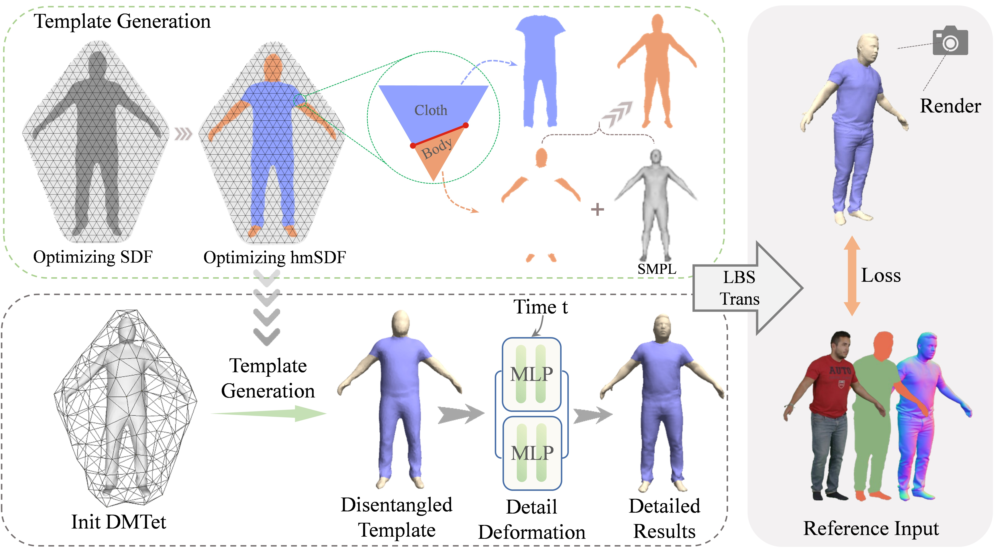

# D3-Human: Dynamic Disentangled Digital Human from Monocular Video

PyTorch implementation of the paper "D3-Human: Dynamic Disentangled Digital Human from Monocular Video". This repository contains the reconstructing code and data.

**|[Project Page](https://ustc3dv.github.io/D3Human/)|**  **|[Paper](https://arxiv.org/html/2501.01589v1)|**

This method can reconstruct disentangled garment and body geometry from monocular videos.

## Pipeline
Neural-ABC is a neural implicit parametric model with latent spaces of human identity, clothing, shape and pose. 
It can generate various human identities and different clothes. 
The clothed human body can deform into different body shapes and poses. 



## Setup

This code has been tested on Tesla V100. 

Environment:
* Ubuntu 20.04
* python 3.8.19

Run the following:
```
pip install ninja imageio PyOpenGL glfw xatlas gdown
pip install git+https://github.com/NVlabs/nvdiffrast/
pip install --global-option="--no-networks" git+https://github.com/NVlabs/tiny-cuda-nn#subdirectory=bindings/torch
```

Download the female SMPL-X model from https://smpl-x.is.tue.mpg.de/ and place them in the folder of `./smplx`.

Download the preprocess data from [here](https://drive.google.com/drive/folders/1-OY5X7pnt45XBMURVTM55xhOrKKUi7BX?usp=sharing) and place it in the folder of `./data`.

## Reconstruction

Use the following code to reconstruct:

```
CUDA_VISIBLE_DEVICES=0 python train.py -o res/f3c --folder_name female-3-casual --config configs/f3c.json
```


## Dataset Preparation
If you wish to reconstruct your own monocular video, you can use ​​[ExAvatar​​](https://github.com/mks0601/ExAvatar_RELEASE) to obtain SMPL-X coefficients and camera parameters, ​​[Sapiens](https://github.com/facebookresearch/sapiens) to obtain normals, and ​​[SAM2](https://github.com/facebookresearch/sam2) to obtain masks for garments, the body, and the fully clothed human.

## Notes
If MeshLab cannot be executed from the command line, you can manually perform remeshing and watertight processing within the software.

## Citation

If you find our paper useful for your work please cite:

```
      @article{Chen2024D3human,
         author = {Honghu, Chen and Bo, Peng and Yunfan, Tao and Juyong, Zhang}, 
         title = {D$^3$-Human: Dynamic Disentangled Digital Human from Monocular Video}, 
         journal={Proceedings of the IEEE/CVF Conference on Computer Vision and Pattern Recognition (CVPR)},
         year={2025}
        }
```

## Contact
For more questions, please contact honghuc@mail.ustc.edu.cn

## Acknowledgement

Our data is processed with the help of [G-Shell](https://github.com/CrisHY1995/StereoPIFu_Code):
```
@inproceedings{Liu2024gshell,
    title={Ghost on the Shell: An Expressive Representation of General 3D Shapes},
    author={Liu, Zhen and Feng, Yao and Xiu, Yuliang and Liu, Weiyang 
      and Paull, Liam and Black, Michael J and Sch{\"o}lkopf, Bernhard},
    booktitle={ICLR},
    year={2024}
}

```
